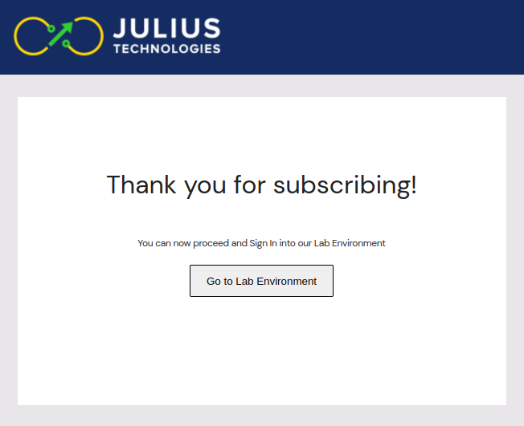

|                                          **Rapid Access**                                                 |
|:--------------------------------------------------------------------------------------------------------- |
|  |

# Welcome to the New World of Graph Computing! 👋

We are a group of researchers and engineers passionate about [graph computing](https://www.juliustech.co/blog/why-graph-computing-is-stellar).
We believe graph technology solves some of the most challenging problems in computing. We spent the
past few years at [Julius Technologies](https://www.juliustech.co/) building a truly
innovative graph computing solution: the Julius Graph Engine. We are excited to offer
developers free access to Julius' online development environment, where you can learn and
test drive graph computing and graph programming using Julius Graph Engine.

In this repository, you will find instructions to [register for free developer
access](https://github.com/JuliusTechCo/JuliusGraph#register-for-developer-access) to
Julius' development environment, and a number of tutorials that can help you get started.
These tutorials illustrate the benefits of graph computing in solving real world problems.
Once you go through these tutorials, you will appreciate the power, simplicity and elegance of graph
computing and graph programming, you will never look at programming the same way again!

Please raise a github issue in this repo for bugs or feature requests, or email us at info@juliustech.co
for general questions or inquiries.

## Tutorials

Our tutorials are available in two formats:

- As interactive jupyter notebooks hosted in Julius' development environment. It is the best
  format for you to learn and experiment with graph computing interactively. To gain access
  to these online tutorials notebooks, please [register for developer
  access](https://github.com/JuliusTechCo/JuliusGraph#register-for-developer-access), it
  only takes a minute!

- As static HTML pages, which contains the same descriptions, source code and results as the
  notebooks, but they are not interactive. If you want to read about Julius Graph Engine and
  its capabilities without register for developer access, please click
  [here](https://JuliusTechCo.github.io/JuliusGraph/dev/) to access the tutorials in HTML
  format. The HTML is also a good format to share with your colleagues or fellow developers.

## Register for Developer Access

Register for developer access is super easy and it only takes a minute. Please proceed to
[www.juliusgraph.com/user/signup](https://www.juliusgraph.com/user/signup). The web site uses Google authentication,
you will be prompted to log in using your Google account credentials if you are not already
signed in with Google:

  

Once you are are authenticated with your Google account, you will be asked to enter some
basic information about yourself. You can switch to a different google account using the
link on the right upper corner.

  

Once you filled in the form and accepted the term and conditions, please hit the *Request access*
button, you will be directed to the following page:

  

That's it! You have now registered as a Julius developer and you can proceed to our Jupyter
Lab Environment by clicking *Go to Lab Environment*. Then you will be asked to sign in once
more using the same google credentials you have just registered:

  

Clicking *Sign in with Google* will land in a standard Jupyter Hub/Juypter Lab session:

Once you have completed the steps, next time you can directly access our developer
environment using this [url](https://www.juliusgraph.com/lab).

### General Layout

After logging into Julius development website, you will find a standard Jupyter lab session.
On the left panel, there is a `README.md` file with some useful information, and a few
pre-created folders containing:

* `assets`: static images for tutorials,
* `data`:  static data files for tutorials,
* `tutorials`: tutorials in jupyter notebook format,
* `persist`: the only folder persisted to long term storage, you should save your work here
  to avoid losing them upon server restarts.

Ideally, tutorials should be read in order. This is because some tutorials depend on
concepts explained in previous tutorials. However, we have you covered even if you are short
on time!. In that case, we recommend reading (at least):

* [Quick Start](https://JuliusTechCo.github.io/JuliusGraph/dev/pages/t001_quickstart.html),
* [MapReduce](https://JuliusTechCo.github.io/JuliusGraph/dev/pages/t003_mapreduce.html) and
* [Distributed Machine Learning Pipeline](https://JuliusTechCo.github.io/JuliusGraph/dev/pages/t004_distributedml.html).

Those tutorials should give you the key ideas on graph computing and graph programming on
Julius' Graph Engine.

### Running a Tutorial

All tutorials come with a short paragraph explaining how to run them. We reproduce these
instructions below:

* Select "run all cells" on this notebook from the Run menu in Jupyter notebook or Jupyter
  lab. This step will produce intermediate data output and charts.
* Some cells print out a url, which you can click on and bring up an interactive web UI to
  visualize the graph data.
* In the unlikely event that the notebook becomes irresponsive, you can try "Restart Kernel"
  from the Kernel menu, then run individual cells one by one using `Shift+Enter`.
* Some tutorials use local clusters consisting of multiple processes to mimic the effects of
  graph distribution over a remote clusters. By default, these local clusters automatically
  stop after idling for 15 minutes to conserve CPU and memory resources. You will need to
  rerun the entire notebook if your local cluster stopped due to inactivity.
* Additional resources (video demos & blogs) are available in our
  [website](http://juliustech.co).
* To report any issues, get help or request features, please raise an issue
  [here](https://github.com/JuliusTechCo/JuliusGraph/issues).

### Web User Interface

Each time a tutorial displays a graph, it will also display an url to the Julius WebUI,
which is a great tool to navigate and visualize the computational graph and all intermediate
results. The following are some snapshots for your reference:

Thank you for reading up to this point 🙌. If you are interested in using graph computing
for your next project, please don't hesitate to get in touch with us. We would love building
incredible solutions with you for real world problems.

Questions? you may want to check out this Julius [FAQ](https://github.com/JuliusTechCo/JuliusGraph/blob/main/FAQ.md) page,
or email us at info@juliustech.co .
